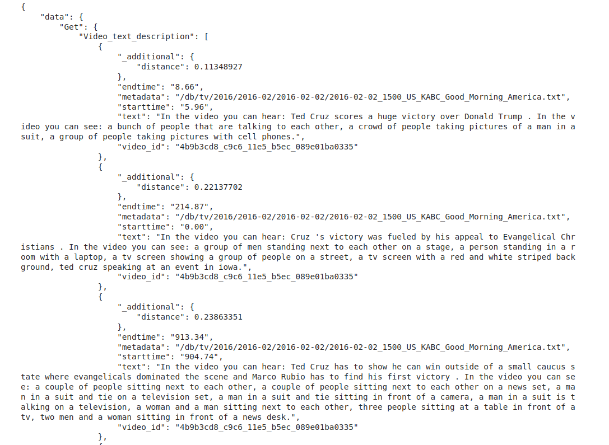
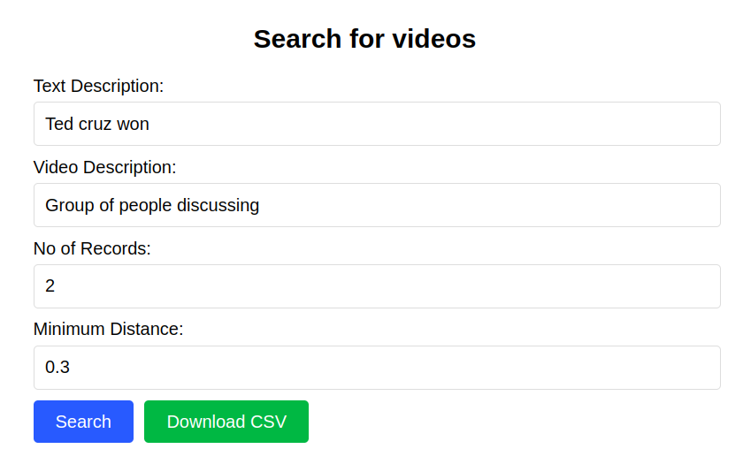
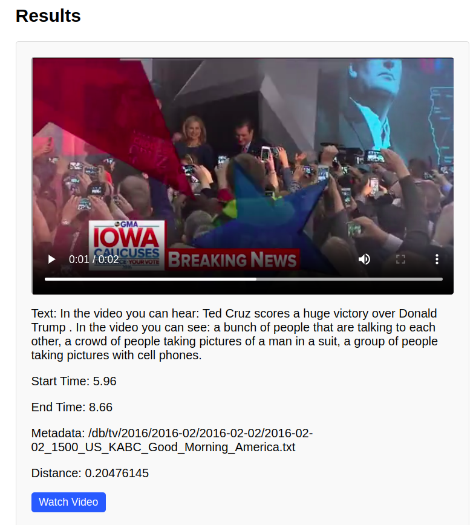
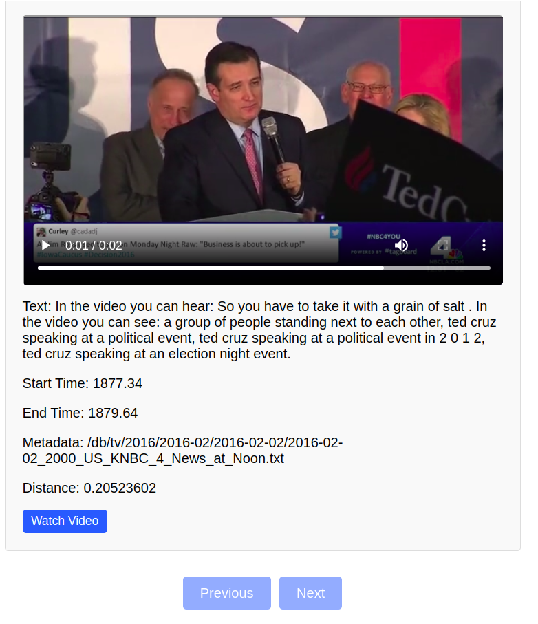
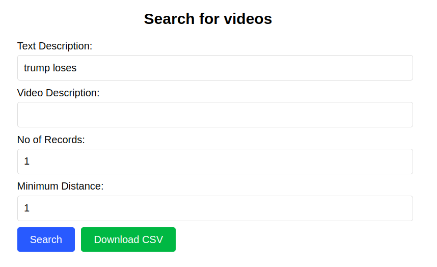

# Semantic-search-in-video-datasets

I propose to create a semantic multimodal search engine for collections of transcribed and aligned videos using state-of-the-art artificial intelligence models of different types, including NLP (Large Language Models) for text generation and capturing the semantics of transcriptions, as well as image description models to understand what is being seen in the video. Only focusing on the transcribed text does not help much, considering the context, what is being shown in the video will be helpful. The search engine will list down the most closest matches to the user query containing the metadata like link to the video, video-id, timestamp, text.

To get more details refer my detailed [blog.](https://dhruv-kunjadiya.notion.site/Semantic-search-in-video-datasets-3c73c303c56748b497a975b1397d84ef) Here I have given my weekly progress details and explanations.

# Project Details


- Specific Details regarding the models used and reason for that, vrt data format and how is the data populated, schema used for weaviate, this all details are there in my project [blog](https://dhruv-kunjadiya.notion.site/Semantic-search-in-video-datasets-3c73c303c56748b497a975b1397d84ef).

- I have attached more detailed information and pictures for each step in my blog.


## How does query works

Lets take example of how a single sentence looks in the json that we formed from vrts and video files.

```json
{
   "sentence": "We 're going to have a tremendous victory .",
   "starttime": "593.83",
   "endtime": "596.14",
   "verbs": [
    {
     "vword": "&apos;re",
     "vstart": "593.83",
     "vend": "593.83",
     "vpos": "VBP"
    },
    {
     "vword": "going",
     "vstart": "593.83",
     "vend": "593.83",
     "vpos": "VBG"
    },
    {
     "vword": "have",
     "vstart": "594.49",
     "vend": "594.75",
     "vpos": "VB"
    }
   ],
   "frame_data": [
    "a man in a suit and red neck tie . ",
    "a man in a suit and red tie . ",
    "a picture of donald trump with his mouth wide open . "
   ]
  },
```
Below is the code for storing data in weaviate for all the sentences in each videos.

```python
combined_text = "In the video you can hear: " + sent['sentence'] + " In the video you can see: " + ", ".join([sentence.strip(" .") for sentence in sent['frame_data']]) + '.'
embedding_video_text_desc = model.encode(combined_text)
                properties_video_text_desc = {
                   "text": combined_text,
                   "starttime" : sent['starttime'],
                   "endtime" : sent['endtime'],
                   "metadata" : metadata,
                   "video_id" : video_id
                }
                client.batch.add_data_object(
                    properties_video_text_desc,
                    "Video_text_description",
                     vector = embedding_video_text_desc
                )
```

Here, I am using ```all-MiniLM-L6-v2``` for getting embeddings of combined text. So for each sentence, I am storing combined_text, starttime, endtime, metadata, video_id and vector embeddings which will be used for similarity search.

Below code shows a sample query.

```python
text_search_input = "Ted Cruz scores a huge victory"
image_search_input = "a group of people taking photos"
combined_text = "In the video you can hear: " + text_search_input + "In the video you can see: " + image_search_input
vector = model.encode(combined_text)

response = (
    client.query
    .get("Video_text_description", ["text", "starttime", "endtime", "metadata","video_id"])
    .with_near_vector({
        "vector" : vector
    })
    .with_limit(5)
    .with_additional(["distance"])
    .do()
)
print(json.dumps(response, indent=4))
```
Output of above query 



## Screenshots of app



- Here, you can keep the Text Description empty as well, only enter Video Description, Weaviate will fetch results as per video Descriptions. You can select only text description as well.

- Three options are there, only text desc, only video desc, both text and video description.








# Setting up the project

1. git clone https://github.com/Dhruv454000/Semantic-search-in-video-datasets.git

2. Install miniconda

3. conda create --name Semantic-search

4. conda activate Semantic-search

5. cd Semantic-search-in-video-datasets/

6. pip install -r requirements.txt

7. To Download videos :

   First do ```cd input_files```

   Download videos from [here.](https://drive.google.com/drive/folders/1lreNRRVrBYWALZxHeQcsEcivk-jMTOQQ?usp=sharing)

8. Do ```mkdir frames``` in which ffmpeg frames will be temporarily stored.

# Running Scripts and Step by Step Process

1. We will first generate metadata and sentence start and end time using ```extract_data_all_files.py```. In the ```input_files``` folder ONLY keep .vrt and .mp4 files of videos for which you want to populate data to weaviate (Delete files for which json is already generated). Also verify that for every .vrt file there is a corresponding .mp4 file.

    To run this script :

    ```
    python3 src/extract_data_all_files.py input_files/ output_data/ 
    ```
    You can also run single file using ```extract_data_from_vrt.py```.

2. After generating json files, we will use ffmpeg to extract frames and generate frame descriptions and add it to our json files. After this step our json files are ready and we can populate data in weaviate.

    To do this run :

    ```
    python3 src/frame_desc_all.py
    ```

    To run it for a single video file use this command :

    ```
    python3 src/frame_desc.py input_files/2016-02-02_1500_US_KABC_Good_Morning_America.mp4 output_data/2016-02-02_1500_US_KABC_Good_Morning_America.v4.json frames/
    ```

3. After the json files are ready, we need to populate data in weaviate.

   ``` cd Semantic-search-app ``` then do ```docker compose up```. This will start our weaviate instance.
   Now to connect to weaviate and populate data in weaviate see ```weaviate_data_populate.ipynb``` . I have given more details in the notebook.

5. To use the app, visit (http://labyrinth01.inf.um.es:8030/)

6. To make any changes in the Semantic Search App

    cd Semantic-search-app

    Do your changes

    docker compose build  (if it gives error do sudo docker compose build)

    docker compose up

    open (http://labyrinth01.inf.um.es:8030/) in your browser to see the app running.

# To do all things using a single script

Go to src/main.ipynb, run all the cells as per the instructions.

# For Questions

You can contact me on [Linkedin](https://www.linkedin.com/in/dhruv-kunjadiya-18b994227/) or drop a mail over [here](mailto:dhruvkunjadiya55@gmail.com).